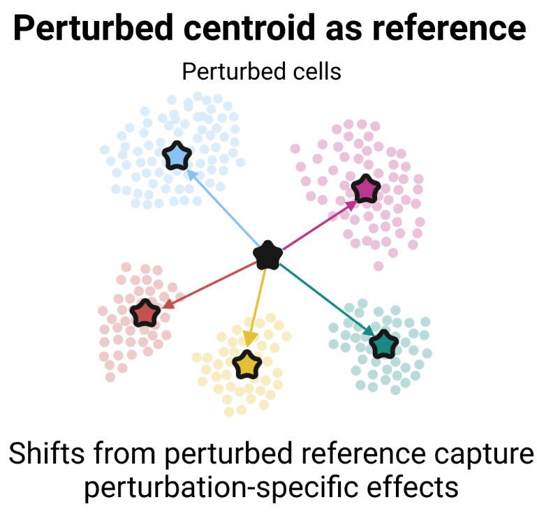
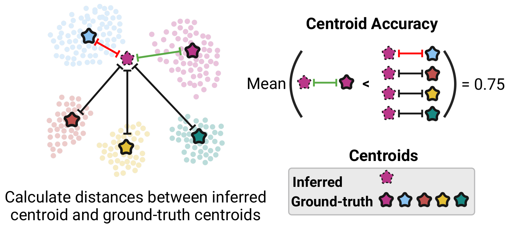

# Evaluation framework

#### PearsonΔ metrics with custom reference



For a given perturbation, the PearsonΔ metrics with a custom reference can be calculated as follows:
```python
from pearson_delta_reference_metrics import pearson_delta_reference_metrics

n_genes = 1000
pert_mean = np.random.random(size=n_genes) * 0.01  # Reference
X_true = np.random.random(size=n_genes)  # ground-truth post-perturbation profiles for a given perturbation, shape=(n_genes,).
X_pred = np.random.random(size=n_genes)  # predicted post-perturbation profiles for a given perturbation, shape=(n_genes,).
top20_de_idxs = np.random.choice(n_genes, 20)  # list of gene indices of the top 20 differentially expressed genes.
pearson_delta_reference_metrics(X_true, X_pred, reference=pert_mean, top20_de_idxs=top20_de_idxs)

# Outputs:
# {'corr_all_allpert': 0.08615381067940589,
# 'corr_20de_allpert': -0.040461998248737946}
```
where:
* `X_true` and `X_pred` are the ground-truth and predicted post-perturbation profiles for a given perturbation. The shape of these vectors is: `shape=(n_genes,)`.
* `top20_de_idxs` is a list of gene indices of the top 20 differentially expressed genes.
* `pert_mean` is the reference.

The perturbed centroid reference can be calculated with the function `average_of_perturbation_centroids`. For example:
```python
from eval_utils import average_of_perturbation_centroids

pert_adata = train_adata[train_adata.obs['control'] == 0]
pert_mean = average_of_perturbation_centroids(pert_adata)
```

---

#### Centroid accuracy

 

The centroid accuracies for held out perturbations can be calculated as follows:
```python
from centroid_accuracy import calculate_centroid_accuracies

genes = ['G1', 'G2', 'G3', 'G4']
perts = ['P1', 'P2', 'P3']
methods = ['M1', 'M2']

# Predictions
agg_post_pred_df = pd.DataFrame(np.random.random((len(perts) * len(methods), len(genes))), columns=genes)
agg_post_pred_df.index = pd.MultiIndex.from_product([perts, methods], names=['condition', 'method'])

# Ground-truth
post_gt_all_df = pd.DataFrame(np.random.random((len(perts), len(genes))), index=perts, columns=genes)

# Scores
scores_df = calculate_centroid_accuracies(agg_post_pred_df, post_gt_all_df)
```
where:
* `agg_post_pred_df` is a Pandas dataframe with the inferred post-perturbation profiles of each method. Columns correspond to genes. Each row corresponds to the predictions of a method for a given test perturbation. Expects a DataFrame with a _MultiIndex_.
* `post_gt_all_df` is a Pandas dataframe with the ground truth post-perturbation profiles. Rows: perturbations, columns: genes.

For example, `agg_post_pred_df` is a dataframe of this format:
|              |       G1 |       G2 |       G3 |       G4 |
|:-------------|---------:|---------:|---------:|---------:|
| ('P1', 'M1') | 0.872002 | 0.572361 | 0.567489 | 0.453441 |
| ('P1', 'M2') | 0.322969 | 0.93358  | 0.400407 | 0.874316 |
| ('P2', 'M1') | 0.165515 | 0.804183 | 0.1392   | 0.550033 |
| ('P2', 'M2') | 0.278022 | 0.419928 | 0.31385  | 0.501067 |
| ('P3', 'M1') | 0.296206 | 0.409046 | 0.132048 | 0.873586 |
| ('P3', 'M2') | 0.762164 | 0.29152  | 0.29255  | 0.932951 |

And `post_gt_all_df` is  a dataframe of this format:
|    |         G1 |       G2 |       G3 |       G4 |
|:---|-----------:|---------:|---------:|---------:|
| P1 | 0.00902307 | 0.75754  | 0.802454 | 0.729122 |
| P2 | 0.576315   | 0.631106 | 0.386992 | 0.164809 |
| P3 | 0.87963    | 0.628103 | 0.394428 | 0.694591 |

The function `calculate_centroid_accuracies` returns a Pandas dataframe with the centroid accuracies of each method for each test perturbation. For example:
| condition   |   M1 |   M2 |
|:------------|-----:|-----:|
| P1          |    0 |    1 |
| P2          |    1 |    1 |
| P3          |    1 |    1 |

---

#### ROC-AUC for coarse-grained phenotypes
Given a list of test perturbations, a dictionary mapping phenotypes to perturbations (e.g. based on prior knowledge), and a list of phenotype names, we can use the `get_perts` function to select the matching test perturbations of each phenotype:
```python
from centroid_reference_scores import get_perts
 
perts = ['P1', 'P2', 'P3', 'P4', 'P5', 'P6', 'P7']
phenotypes = {'A': ['P1', 'P2'],
              'B': ['P3', 'P4', 'P5'],
              'C': ['P6', 'P7']
             }
class1_perts = get_perts(test_perts=test_perts,
                         phenotypes=phenotypes, 
                         phenotype_names=['A', 'B'])
class2_perts = get_perts(test_perts=test_perts,
                         phenotypes=phenotypes, 
                         phenotype_names=['C'])
# class1_perts: array(['P1', 'P2', 'P3', 'P4', 'P5'], dtype='<U2')
# class2_perts: array(['P6', 'P7'], dtype='<U2')
```

Then, given the ground-truth `post_gt_df` and predicted `post_pred_df` post-perturbation profiles, we score the predictions against the class-specific centroids by calculating the Euclidean distance for each class and perturbation:

```python
from centroid_reference_scores import score_centroids

perts_dict = {'Class 1': class1_perts,
              'Class 2': class2_perts}

methods = ['M1', 'M2']
post_gt_df =  pd.DataFrame(np.random.random((len(perts), len(genes))), index=perts, columns=genes)
post_pred_df = pd.DataFrame(np.random.random((len(perts) * len(methods), len(genes))), columns=genes)
post_pred_df.index = pd.MultiIndex.from_product([perts, methods], names=['condition', 'method'])

labels, scores_dict = score_centroids(post_gt_df, post_pred_df, perts_dict, methods=methods)

# Outputs:
# labels:
# array([[1., 0.],
#       [1., 0.],
#       [1., 0.],
#       [1., 0.],
#       [1., 0.],
#       [0., 1.],
#       [0., 1.]])
#
# scores_dict: {'M1': array([[-0.15234264, -0.20890791],
#        [-0.10780986, -0.15559565],
#        [-0.09670361, -0.12372645],
#        [-0.03305224, -0.07582319],
#        [-0.07578471, -0.12732833],
#        [-0.23086345, -0.27957696],
#        [-0.0623834 , -0.05152862]]),
#    'M2': array([[-0.08816993, -0.04871326],
#        [-0.07247456, -0.04941172],
#        [-0.02100748, -0.03122475],
#        [-0.16204577, -0.17243494],
#        [-0.05858722, -0.04327084],
#        [-0.10909909, -0.10398108],
#        [-0.22491337, -0.3008563 ]])}
```

where:
* `post_gt_df` is a Pandas dataframe with the ground truth post-perturbation profiles. Rows: perturbations, columns: genes.
* `post_pred_df` is a Pandas dataframe with the inferred post-perturbation profiles of each method. Columns correspond to genes. Each row corresponds to the predictions of a method for a given test perturbation. Expects a DataFrame with a _MultiIndex_, where the first index is the condition (test perturbation) and the second is the method.
* `perts_dict` is a dictionary of reference centroids (i.e. coarse phenotype) -> list of test perturbations
* `methods` is a list of methods with predictions in post_pred_df

This function returns two outputs:
* `labels`: Numpy array of shape `(n_test_perturbations, n_reference_centroids)` indicating what phenotype each test perturbation belongs to
* `scores_dict`: dictionary method_name to Numpy array of shape `(n_test_perturbations, n_reference_centroids)` with scores for each test perturbation and reference centroid. Higher scores indicates higher likelihoods of perturbation inducing a certain phenotype

The function `plot_binary_roc` takes these two outputs as well as `methods` and plots a ROC curve.

---
## Quick description

The files `eval_utils.py`, `pearson_delta_reference_metrics.py`, and `centroid_accuracy.py` contain utility functions to calculate metrics employed in our benchmark. The notebooks `benchmark_all.ipynb`, `centroid_accuracy.ipynb`, and `replogle_gwps_downstream.ipynb` use these metrics to evaluate performance and perform downstream analyses of the predicted post-perturbation profiles.

